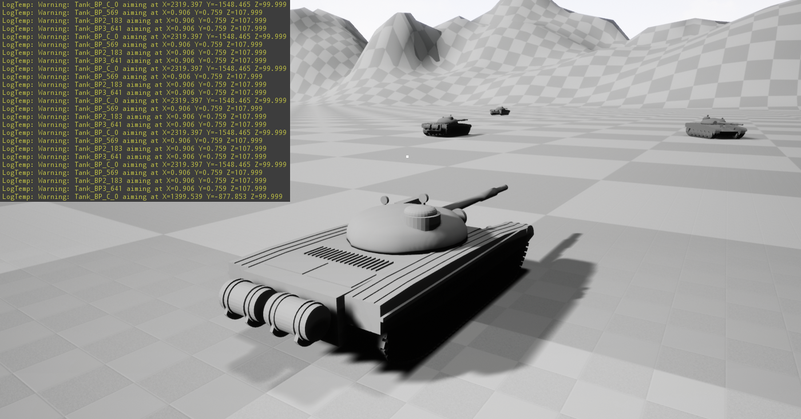

<h2>Table of Contents</h2>

<ul>
<li><a href="#orgcb4da85">1. L139 Creat default sub objects in C++</a>
<ul>
<li><a href="#org3e5113a">1.1. goal</a></li>
<li><a href="#orgc4f4ee4">1.2. result</a></li>
<li><a href="#orgf5438b7">1.3. notes in lecture</a></li>
<li><a href="#org3ecf60e">1.4. question that I do not understand</a>
<ul>
<li><a href="#org31b5260">1.4.1. crash</a></li>
</ul>
</li>
</ul>
</li>
<li><a href="#org88e8be8">2. L140 Test</a></li>
</ul>

# L139 Creat default sub objects in C++

## goal

Refactoring the code so that the aiming log is a separated class.

## result

[Result](Source/screenCapture/tankBodyOutPutCorrectAimingLocation.png)

Finally, I got auto-org-mode to assist me&#x2026;&#x2026;&#x2026;&#x2026;

Testing&#x2026;.

## notes in lecture

## question that I do not understand

### crash

When I try to get the owner of the 'aiming component', the UE
crush without any info.

# L140 Test

